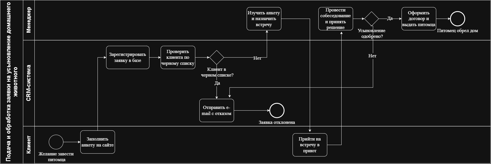

# Pet1
# Техническое задание: Модуль автоматической обработки заявок на усыновление питомца

## 1. Бизнес-процесс (BPMN)

Данный модуль автоматизирует первичный отбор кандидатов на усыновление животных. Система должна автоматически отсекать неблагонадежных пользователей по черному списку до того, как заявка попадет на ручную обработку к менеджеру приюта.

> 
>  

---

## 2. Функциональные требования (User Story)

Для реализации клиентской части на сайте приюта необходимо разработать форму сбора данных.

### US-1. Форма подачи заявки на сайте

- **Как:** Посетитель сайта (клиент),
- **Я хочу:** иметь возможность заполнить анкету и выбрать питомца,
- **Чтобы:** отправить заявку в приют и запустить автоматическую проверку.

**Критерии приемки (Acceptance Criteria) для фронтенда:**

1. На форме должны быть обязательные поля: *ФИО*, *Телефон*, *Кличка питомца*. Поле *Email* — опциональное.
2. Если обязательные поля не заполнены, кнопка «Отправить» должна быть заблокирована.
3. Поле «Телефон» должно валидироваться на бэке и фронте (принимать только цифры, формат РФ: +7/8).
4. При успешной отправке формы вызывать метод API: `POST /api/v1/adoption-requests`.
5. При успешном ответе от сервера показывать пользователю сообщение: *«Спасибо! Ваша заявка принята и находится на проверке. Мы свяжемся с вами в течение 2-х дней»*.

---

## 3. Интеграционные требования (REST API)

Для передачи данных с фронтенда (сайта) на бэкенд (сервер) используется REST API. Данные передаются в формате JSON.

- **Метод:** `POST`
- **Путь (URL):** `/api/v1/adoption-requests`

### Тело запроса (Request Body):

```json
{
  "client_name": "Иванов Иван Иванович",
  "client_phone": "+79991112233",
  "client_email": "ivan@mail.ru",
  "animal_id": "a1111111-1111-1111-1111-111111111111"
}
```

### Ответ сервера при успехе (Response 201 Created):

```json
{
  "success": true,
  "message": "Заявка успешно зарегистрирована",
  "request_id": "04444444-4444-4444-4444-444444444444",
  "status": "Новая"
}
```

---

## 4. Требования к данным и бэкенд-логике (PostgreSQL)

Данные из заявок должны сохраняться в реляционной базе данных PostgreSQL согласно спроектированной ER-диаграмме.

 .png)

### Алгоритм работы бэкенда при получении запроса:

1. При получении JSON-пакета от фронтенда система должна создать новую запись в таблице `adoption_requests` со статусом `«Новая»`.
2. Система выполняет автоматический SQL-запрос в таблицу `clients` для проверки флага `is_blacklisted` по указанному телефону/email.
3. **Разветвление логики (согласно BPMN-схеме):**
   - **Если** `is_blacklisted = TRUE`: Система мгновенно переводит статус заявки в таблице `adoption_requests` на `«Отклонено»` и отправляет триггерное письмо с отказом на Email клиента. Менеджер эту заявку в своей админке не видит.
   - **Если** `is_blacklisted = FALSE`: Система переводит статус заявки на `«На рассмотрении»` и отправляет уведомление в личный кабинет Менеджера приюта для ручного разбора.

---

## 5. Ожидаемый бизнес-эффект от внедрения модуля

Реализация модуля автоматической фильтрации анкет и интеграции с черным списком позволяет достичь следующих результатов:
1. Автоматический отсев неблагонадежных заявителей на этапе отправки формы снижает нагрузку на менеджеров приюта на 40%. Сотрудники больше не тратят время на ручную проверку заведомо «отказных» анкет.
2. Исключение человеческого фактора при первичной проверке контрагентов. Система гарантированно блокирует заявки от лиц, занесенных в черный список, минимизируя риски повторного жестокого обращения с животными.
3. Менеджеры приюта работают только с целевыми, прошедшими первичный скоринг анкетами, что ускоряет процесс назначения собеседований и передачи животных в новые семьи на 25%.

